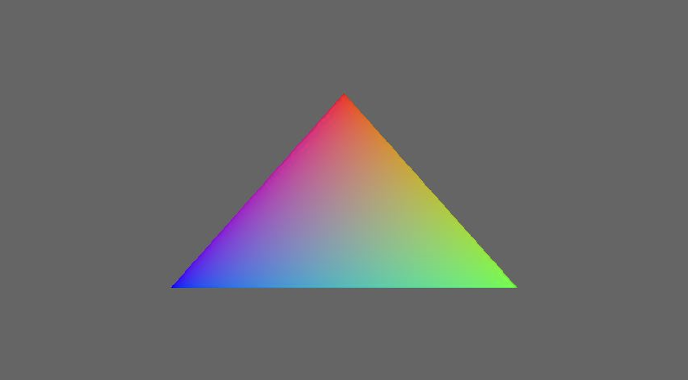
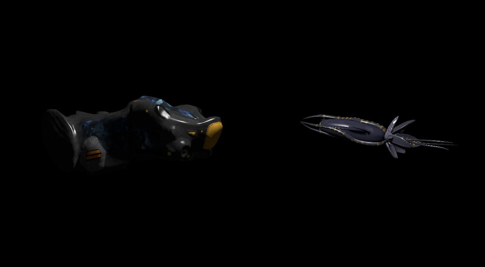
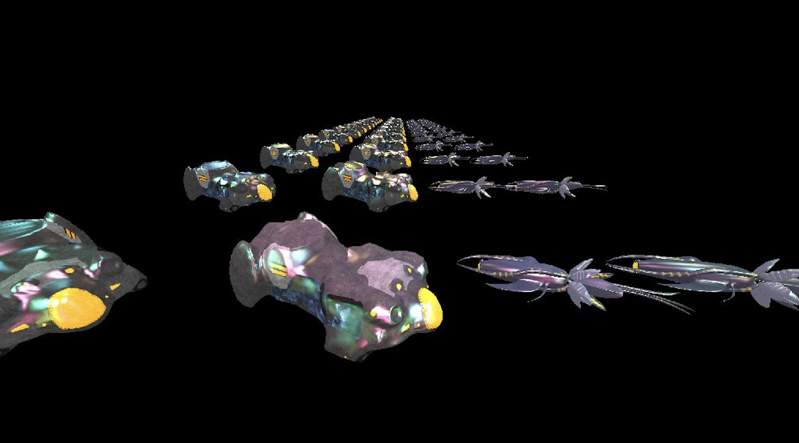
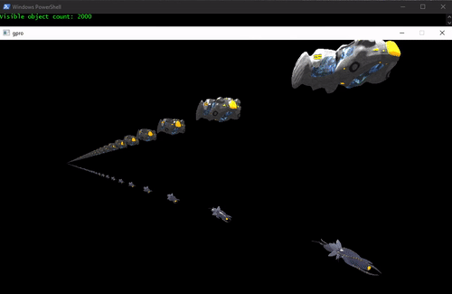
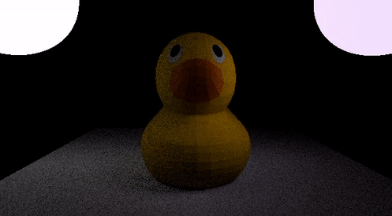
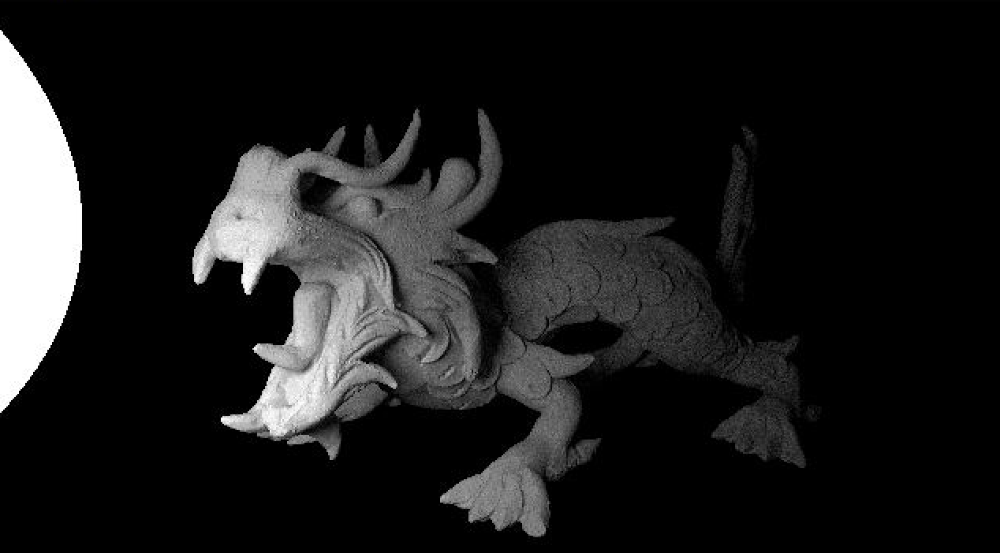
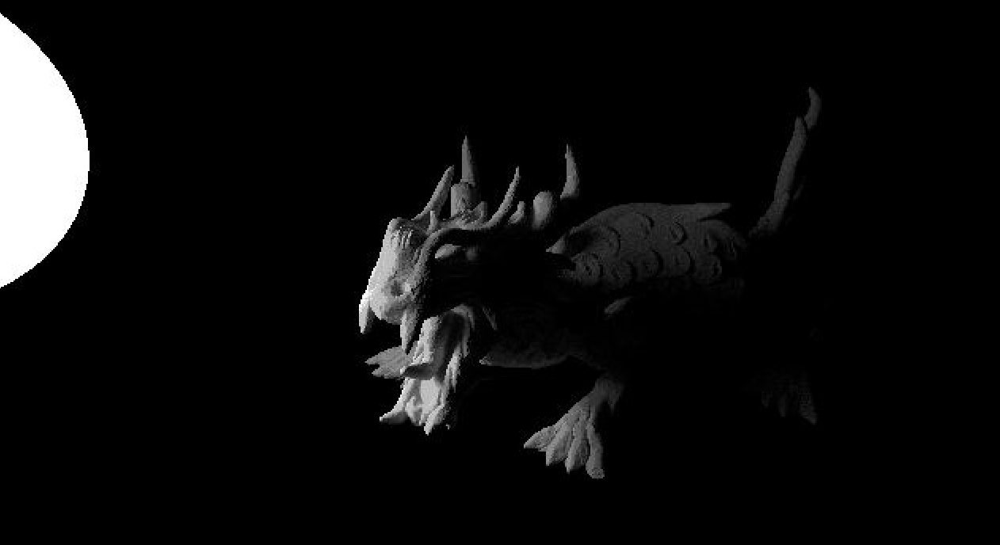

# Vulkan Demos

A series of demos to experiment with the Vulkan API.

## Table of Contents
1. [Platform](#platform)
2. [Getting Started](#getting-started)
3. [Demos](#demos)
   - [Demo-01: Triangle](#demo-01-triangle)
   - [Demo-02: Forward Rendering](#demo-02-forward-rendering)
   - [Demo-03: Deferred Rendering + Post Processing](#demo-03-deferred-rendering--post-processing)
   - [Demo-04: Instanced Rendering + Dynamic Batching](#demo-04-instanced-rendering--dynamic-batching)
   - [Demo-05: GPU Driven Rendering](#demo-05-gpu-driven-rendering)
   - [Demo-06: Path Tracing + Motion Vectors](#demo-06-path-tracing--motion-vectors)
   - [Demo-07: Path Tracing with BVH](#demo-07-path-tracing-with-bvh)
   - [Demo-08: Path Tracing with RTX](#demo-08-path-tracing-with-rtx)
4. [License](#license)

## Platform
**Operating system:** Tested only on Windows.

**Hardware:** Only to run the [demo-08](./demo-08), a GPU with RTX support is required.

## Getting started

1) Install the [Vulkan SDK](https://vulkan.lunarg.com/sdk/home) if it is not already installed.

2) Download the repository with its dependencies using: 
    ```
    git clone --recursive https://github.com/alpcihan/vulkan-demos
    ```
3) Use `CMakeLists.txt` at the root to build the project with CMake. It will create corresponding demo executables with `demo-<id>` naming format (e.g., `demo-01.exe`).

## Demos

### Demo-01 (Triangle)

#### Features
1) A true work of art

#### Screenshot



### Demo-02 (Forward Rendering)

#### Features:
1) Forward rendering
2) Blinn-Phong shading

#### Screenshot



### Demo-03 (Deferred Rendering + Post Processing)

#### Features:
1) Deferred rendering
2) Blinn-Phong shading with dozens of lights
3) Post-processing pass with dithering effect

#### Screenshots:

<br>


### Demo-04 (Instanced Rendering + Dynamic Batching)

#### Features:
1) Instanced Rendering
2) Dynamic Batching
3) Scene loading and updating on runtime

#### How to use
##### Runtime obj loading
- Add <modelname\>.obj and <modelname\>.yaml under [resources/models](./resources/models)
- Add <modelname\>.png under [resources/textures](./resources/textures)
##### Runtime config update
- Update <modelname\>.yaml (position, scale, instance count, pattern)
##### Camera controller
- Use WASD, Shift Space and arrows to move the scene camera.

#### Video


### Demo-05 (GPU Driven Rendering)

#### Features
1) GPU-driven rendering pipeline
2) Instanced indirect rendering
3) Frustum culling with compute shader

#### How to use
##### Camera controller
- Move the scene camera by using WASD, Shift Space, and arrows.

#### Video



### Demo-06 (Path Tracing + Motion Vectors)

#### Features
1) Path tracing with Monte Carlo method
2) Motion vector texture generation
3) Depth texture generation
4) Recovering diffuse reflection data with depth + motion vector

#### Video



### Demo-07 (Path Tracing with BVH)

#### Features
1) Path tracing using BVH

#### Screenshot



### Demo-08 (Path Tracing with RTX)

#### Features
1) Path tracing using RTX

#### Screenshot



## License
[MIT license](./LICENSE)
